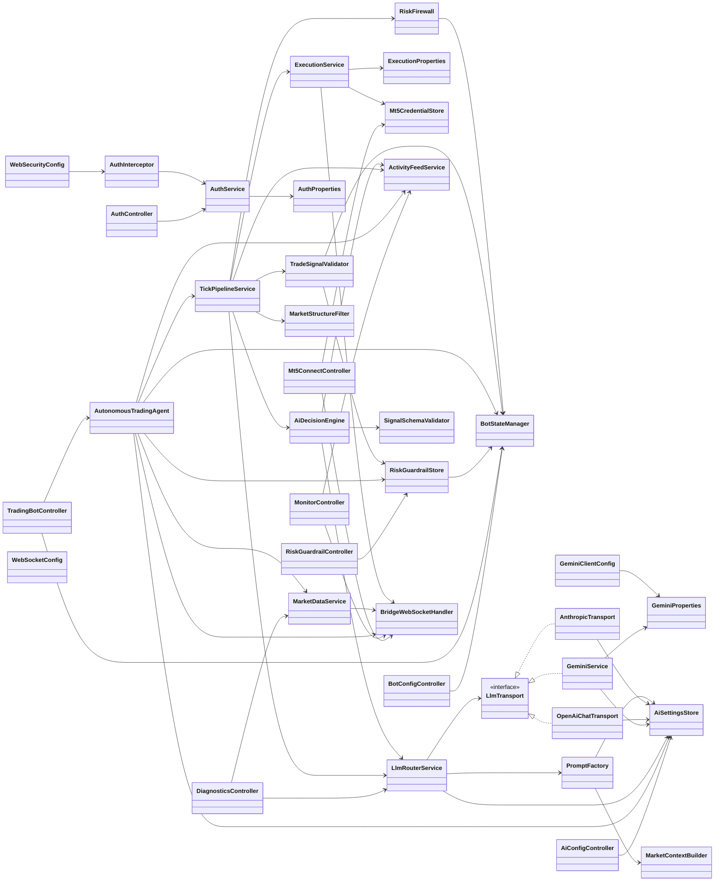
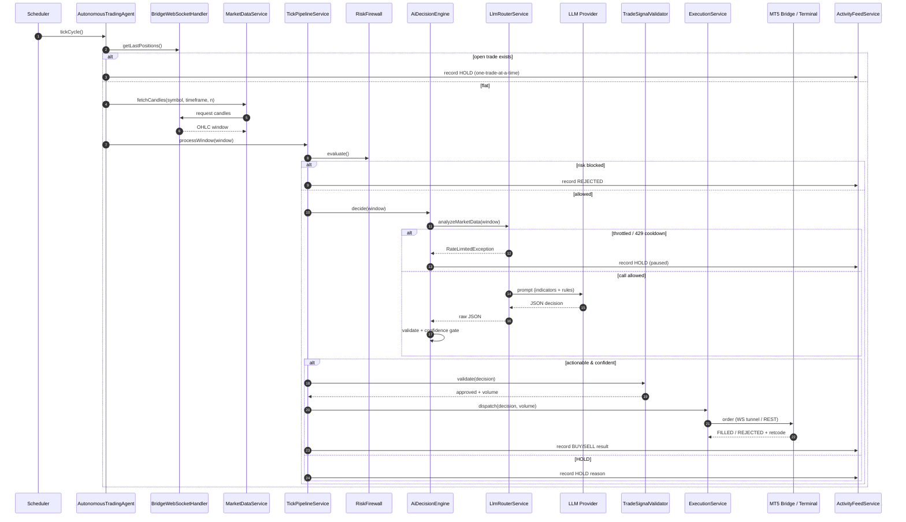

# AI Forex Trading Bot — Architecture & System Map

A complete, end-to-end map of the tool: how the three tiers fit together, what
happens at each step from an end‑user's perspective, and a class diagram of the
backend.

---

## 1. High-level architecture

The system has **three tiers**:

```
┌──────────────────────────┐        HTTPS / REST         ┌──────────────────────────────┐
│  Streamlit Dashboard      │  ───────────────────────▶   │  Spring Boot Backend (Render) │
│  (frontend/streamlit_app) │  ◀───────────────────────   │  REST API + LLM pipeline      │
│  - login, MT5 creds       │        JSON responses        │  - auth, guardrails, AI engine │
│  - AI model & strategy    │                              │  - risk firewall, execution    │
│  - risk guardrails        │                              └───────────────┬──────────────┘
│  - Start/Stop AI          │                                              │ WebSocket (wss://…/ws/bridge)
│  - telemetry + console    │                                              │ commands ▼   ▲ receipts/telemetry
└──────────────────────────┘                              ┌───────────────┴──────────────┐
                                                           │  Local MT5 Bridge (Python)    │
         External LLM providers  ◀── HTTPS ────────────────│  mt5-bridge/mt5_bridge.py     │
         Gemini / OpenAI / Claude / DeepSeek / Grok        │  - MetaTrader5 API            │
                                                           └───────────────┬──────────────┘
                                                                           │ MetaTrader5 IPC
                                                                   ┌───────┴────────┐
                                                                   │  MT5 Terminal   │
                                                                   │  (broker acct)  │
                                                                   └────────────────┘
```

- **Frontend** — Streamlit app; pure UI. Talks only to the backend over REST.
- **Backend** — Spring Boot; the brain. Auth, config stores, the autonomous AI
  loop, risk checks, and execution routing. Deployed on Render.
- **Bridge** — a small Python process that runs **next to MetaTrader 5** on the
  user's machine. Because the broker terminal is behind NAT, the bridge dials
  **out** to the backend over a WebSocket, receives trade commands, and executes
  them via the MetaTrader5 package. It also streams account/position telemetry
  back.

---

## 2. End‑user journey (what happens in the system at each step)

### Step 0 — Prerequisites
- MT5 terminal running and logged into a broker/demo account.
- `mt5_bridge.py` running locally → it connects out to
  `wss://…/ws/bridge` (`BridgeWebSocketHandler` registers the session).

### Step 1 — Open the dashboard
- `streamlit_app.py` loads. `_restore_auth_from_query_params()` checks the URL
  for a saved token so a refresh doesn't log you out.
- If no token → the **login gate** renders and nothing else is shown.

### Step 2 — Fill credentials → click **Log in**
1. Frontend `post_login()` → `POST /api/auth/login` with `{username, password}`.
2. `AuthController.login()` → `AuthService.authenticate()` validates against
   `AuthProperties` (env `AUTH_USERNAME` / `AUTH_PASSWORD`).
3. On success it issues a signed **bearer token** (`LoginResponse{token, expiresAt}`).
4. Frontend stores the token in `st.session_state` **and** the URL query params
   (`_persist_auth_to_query_params()`), so a browser refresh stays signed in.
5. Every later request attaches `Authorization: Bearer <token>`; the
   `AuthInterceptor` guards `/api/bot/**`, `/api/mt5/**`, `/api/risk/**`,
   `/api/ai/**`.

### Step 3 — Enter MT5 broker credentials → **Connect / Save** (+ “Remember me”)
1. `post_mt5_connect()` → `POST /api/mt5/connect` with `{login, password, server}`.
2. `Mt5ConnectController.connect()` stores them in `Mt5CredentialStore` (memory
   only) and pushes a `CONNECT` command down to the bridge via
   `BridgeWebSocketHandler.sendCommand()`.
3. The bridge `initialize_mt5()` logs into the MT5 terminal for that account.
4. **Remember me** persists the (non-secret) login + server in the URL query
   params so the fields survive a refresh until logout.
5. On refresh, `_restore_mt5_state()` calls `GET /api/mt5/status` so the UI knows
   the account is still configured server-side.

### Step 4 — Choose AI Provider, Model, API Key, Timeframe, Trading Type → **Save AI Settings**
1. `post_ai_settings()` → `POST /api/ai/settings` with
   `{provider, model, apiKey, timeframe, tradingStyle}`.
2. `AiConfigController.update()` → `AiSettingsStore.save()` (memory only; the key
   is never returned by `GET`, only `apiKeySet: true/false`).
3. These values **override** the static env/`application.properties` config, so
   the model + key can be wired at runtime with no redeploy.

### Step 5 — Set Risk Guardrails (pairs, lot size, risk %, SL/TP pips, drawdown, autonomous toggle) → **Save**
1. `post_guardrails()` → `POST /api/risk/guardrails` (`RiskGuardrails`).
2. `RiskGuardrailController` → `RiskGuardrailStore.save()`. The drawdown limit is
   mirrored into `BotStateManager` as the daily-loss kill switch.

### Step 6 — Click **Start AI**
1. `post_start()` → `POST /api/bot/start` → `BotStateManager.start()` flips the
   running flag; `BotStatus` is returned.
2. The dashboard immediately fires **one** cycle via `POST /api/bot/run-cycle`
   (`TradingBotController` → `AutonomousTradingAgent.runOnceNow()`).

### Step 7 — The autonomous loop runs (this is the core engine)
`AutonomousTradingAgent.tickCycle()` runs on a schedule
(`agent.poll-interval-ms`). Each cycle:

1. **Gate: running & autonomous enabled?** If not, return.
2. **Gate: one trade at a time.** `hasOpenTrade()` checks
   `BridgeWebSocketHandler.getLastPositions()`. If a position is open → record a
   HOLD notice and skip (no market data, **no API call**) until it closes.
3. For each allowed symbol:
   - `MarketDataService.fetchCandles(symbol, timeframe, n)` pulls OHLC from the
     bridge (`GET /candles` or over the WS tunnel).
   - `TickPipelineService.processWindow(window)` runs the full pipeline ↓

#### The pipeline (`TickPipelineService.processWindow`)
```
1) RiskFirewall.evaluate()            → daily loss / kill switch. Blocked → HOLD.
2) AiDecisionEngine.decide(window):
     a. LlmRouterService.analyzeMarketData(window)
          - Throttle: ≤ one call per candle (timeframe-based) / min interval.
          - 429 cooldown: back off, no hammering.
          - PromptFactory.tradeDecisionPrompt() builds a DISCIPLINED prompt:
              * MarketContextBuilder adds EMA20/50/200, RSI, ATR, swing H/L, trend.
              * Rules: default HOLD, require strategy confluence, RR ≥ 1.5.
          - Routes to the selected provider transport (Gemini/OpenAI/Claude/…).
     b. SignalSchemaValidator.parseAndValidate() → strict TradeDecisionSignal.
     c. Discipline gate: confidence < ai.min-confidence (0.65) → HOLD.
   → HOLD or a BUY/SELL signal.
3) If actionable → TradeSignalValidator.validate():
     - symbol allow-list, drawdown guardrail, position sizing
       (fixed lotSize if set, else risk-% derived).
4) ExecutionService.dispatch(decision, volume):
     - Sends an OrderRequest to the bridge (WS tunnel or REST).
5) ActivityFeedService.record(...) → console line (BUY/SELL/HOLD/REJECTED + reason).
```

#### At the bridge (`mt5_bridge.py → execute_ai_trade`)
- `ensure_mt5()` (idempotent), resolve symbol + live tick.
- Sanitize the ASCII comment; enforce broker **min stop distance**; compute
  instrument-aware **pip size** (gold/silver/indices/FX).
- `order_send()` retrying across supported **filling modes** (FOK/IOC/RETURN);
  drop the comment if the build rejects it.
- Return `FILLED` / `REJECTED` + broker retcode → receipt back over the WS →
  the console shows the result.

### Step 8 — Watch telemetry & the AI Activity Console
- `GET /api/monitor/telemetry` → bridge online?, MT5 connected?, balance/equity.
- `GET /api/monitor/positions` → open positions + P&L.
- `GET /api/monitor/activity` → the decision stream. The **Decision rules** table
  shows *why* each trade passed/was blocked; **🗑 Clear** (`DELETE
  /api/monitor/activity`) wipes it.

### Step 9 — **Stop AI** / **Log out**
- `POST /api/bot/stop` → `BotStateManager.stop()`; the loop idles.
- Logout revokes the token and clears the saved auth + MT5 “remember me” params.

---

## 3. Backend class diagram



---

## 4. Autonomous trade — sequence diagram



---

## 5. Key REST endpoints

| Method & path | Controller | Purpose |
|---|---|---|
| `POST /api/auth/login` | `AuthController` | Authenticate, issue bearer token |
| `POST /api/auth/logout` | `AuthController` | Revoke token |
| `POST /api/mt5/connect` | `Mt5ConnectController` | Save MT5 creds + push to bridge |
| `GET /api/mt5/status` | `Mt5ConnectController` | Is MT5 configured / bridge online |
| `POST /api/ai/settings` | `AiConfigController` | Set provider/model/key/timeframe/style |
| `GET /api/ai/settings` | `AiConfigController` | Read settings (key masked) |
| `POST /api/risk/guardrails` | `RiskGuardrailController` | Save risk guardrails |
| `POST /api/bot/start` \| `/stop` | `TradingBotController` | Start/stop the engine |
| `POST /api/bot/run-cycle` | `TradingBotController` | Trigger one cycle now |
| `GET /api/bot/status` | `BotConfigController` | Bot status snapshot |
| `GET /api/monitor/telemetry` | `MonitorController` | Bridge/account telemetry |
| `GET /api/monitor/positions` | `MonitorController` | Open positions + P&L |
| `GET /api/monitor/activity` | `MonitorController` | AI decision console feed |
| `DELETE /api/monitor/activity` | `MonitorController` | Clear the console feed |
| `WS /ws/bridge` | `BridgeWebSocketHandler` | Bridge command/receipt tunnel |

---

## 6. Safety & pacing controls (why it behaves like a human)

| Control | Where | Effect |
|---|---|---|
| Timeframe pacing | `LlmRouterService` + `AiSettingsStore.timeframeIntervalMs()` | ~1 AI call per candle (M1→1m … D1→1d) |
| Min interval floor | `ai.min-request-interval-ms` | Hard cap on request rate |
| 429 cooldown | `LlmRouterService` | Stop calling after a rate-limit hit |
| One trade at a time | `AutonomousTradingAgent.hasOpenTrade()` | No new trade/API call while a position is open |
| Confidence gate | `AiDecisionEngine` (`ai.min-confidence`) | Low-conviction signals → HOLD |
| Strategy prompt | `PromptFactory` + `MarketContextBuilder` | EMA/RSI/ATR/S-R confluence, default HOLD |
| Risk firewall | `RiskFirewall` / `BotStateManager` | Daily-loss kill switch |
| Guardrail validation | `TradeSignalValidator` | Symbol allow-list, drawdown, position sizing |
```

